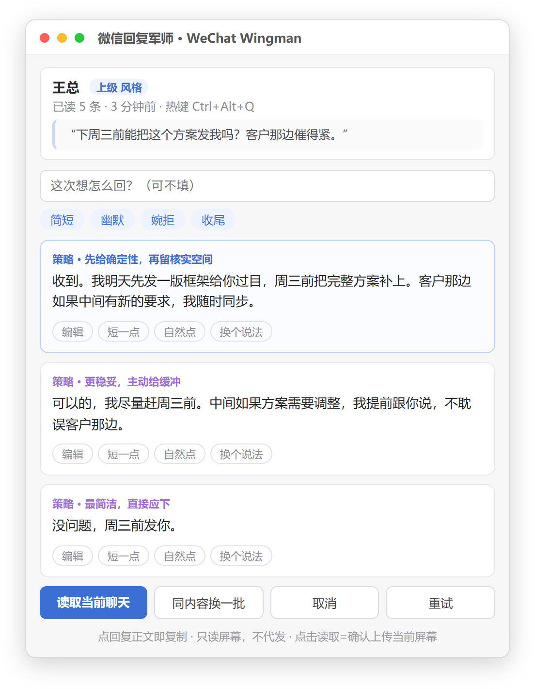

<p align="center">
  
</p>

<h1 align="center">WeChat Wingman · 微信回复军师</h1>

<p align="center"><b>Reads your screen. Suggests replies. Never touches WeChat. Never sends anything.</b></p>

<p align="center">
  <a href="https://www.python.org/downloads/"></a>
  <a href="https://www.python.org/downloads/"></a>
  <a href="LICENSE"></a>
  <a href="#-bring-your-own-model"></a>
  <a href="#-why-not-a-bot"></a>
  <a href="https://github.com/DuggeeChen/wechat-wingman/actions/workflows/ci.yml"></a>
</p>

<p align="center"><b>English</b> · <a href="README.zh-CN.md">中文</a></p>

WeChat Wingman watches the **screen** in front of you and drafts replies for the chat you are looking at — **on demand, on your own machine, with your own model.** Press a hotkey (or click a button), and it reads the current conversation, figures out who you are talking to, and offers a few reply candidates in a matching tone. You click one to copy it, then paste it yourself.

It does **not** hook, inject, or modify the WeChat client. It does **not** read its local database. It does **not** send messages for you. It is a *wingman*, not an autopilot.

<p align="center">
  
</p>

---

## Why not a bot?

Most "AI WeChat reply" projects are auto-send bots or process-hooking tools. They look great in a demo and are risky in practice — injecting into another app's process is fragile, often against the platform's terms, and can get your account flagged.

This project takes the boring-but-safe route, and that's the point:

| | Typical bot / hook tool | WeChat Wingman |
|---|---|---|
| Touches the WeChat client | Hooks / injects the process | **Never** — reads the screen only |
| Sends messages | Automatically | **Never** — you copy & paste |
| Reads chat history | Scrapes the local DB | **Never from WeChat** — only what's on screen, plus chat text *you* paste into the profile window |
| Uploads your chats | Often a remote server | **Only** to the API you configure — the current screen, and any chat text you paste |
| Keeps logs of chats | Usually yes | **No** — logs record lifecycle events only, never content or names |
| Model choice | Locked to one vendor | **Any** OpenAI-compatible vision API |

If you want your replies drafted *for* you — but still want to stay in control and keep your chats yours — this is the tool.

---

## How it works

```
┌───────────────┐   Ctrl+Alt+Q    ┌───────────────────────────────┐
│  WeChat window │◄────────────────│  wx_helper.py (core)          │
│  (on screen)   │   Win32 capture │  hotkey · window locate        │
└───────────────┘                 │  sidebar crop · JPEG encode    │
                                  └───────────────┬───────────────┘
                                                  │ base64 image + prompt
                                                  ▼
                                  ┌───────────────────────────────┐
                                  │  Your model (OpenAI-compatible │
                                  │  vision API — base_url config) │
                                  └───────────────┬───────────────┘
                                                  │ contact + messages + candidates
                                                  ▼
                                  ┌───────────────────────────────┐
                                  │  wx_ui.py (UI)                │
                                  │  candidate cards · copy        │
                                  │  tone switch · refine          │
                                  └───────────────┬───────────────┘
                                                  │ click to copy
                                                  ▼
                                        you paste it yourself

  profile_ui.py (separate window) ── you paste chat text ──► profile.py ──► profiles/<name>.json
                                                                    │
                                                                    └── background block ──► the text-only pass above
```

1. **Trigger** — press `Ctrl+Alt+Q` (or the "读取当前聊天" button). Nothing happens until *you* ask.
2. **Capture** — it finds the WeChat window, crops the sidebar away using the real divider line, and keeps the full height so no latest message is missed.
3. **Understand** — the screenshot goes to your model, which returns the **contact**, the **recent messages**, and **3 reply candidates**, each tagged with a *why* (the strategy behind it).
4. **Match tone** — if the recognized contact has a bound persona (e.g. your boss → 上级) *or* a usable profile, a lightweight text-only second call regenerates the candidates. Your contact list is never sent to the model.
5. **Recall** — if you have built a **person profile** for this contact, its background block rides along with that text-only call, so the reply can account for what you already know about them (what they do, what they care about, what they've said before).
6. **Choose** — click a candidate to copy the text (without the strategy tag), refine it with **edit / shorter / more natural / rephrase**, or ask for **a fresh batch**. Then paste it yourself.

---

## Person profiles — the more you use it, the better it knows them

The reply flow only ever sees the current screen, so on its own it can't know that 周总 is in the building-materials business, or that he hates being asked two questions at once. The profile feature is how that context gets in — and it is **deliberately manual**.

Open the profile window, pick a contact, and **paste 50–100 messages of your chat with them as text** (copy it out of WeChat yourself; the app never touches the database). Then:

- It splits the paste by speaker **locally and deterministically**, so it never has to guess who said what.
- The model extracts observations — each one must come with a **verbatim quote from the paste**. A quote that can't be found in the text is thrown away, so an invented "fact" can't get in.
- You review the list and can reject any entry (「不准」), with one-click undo of the last import (「撤销上次导入」).
- Next time you read that chat, the profile rides along in the text-only pass and the candidates are generated with it in mind.

**The profile is yours and it stays local.** It lives in `profiles/` (git-ignored), is plain JSON you can read and delete, and is never sent for any *other* contact. It reaches the model in exactly two situations: when you explicitly build or update it (the paste goes out in full), and on a read of *that* contact's chat (only a ≤600-character digest, quotes stripped). See [docs/PRIVACY.md](docs/PRIVACY.md) for the exact accounting.

---

## Features

- 🖥️ **Screen-read only** — no injection, no hooks, no DB scraping. WeChat stays untouched.
- ✋ **On-demand** — it analyzes only when you press the hotkey or click the button.
- 👥 **Multi-chat aware** — recognizes who you're talking to and switches tone automatically as you switch chats.
- 🎭 **Per-person tone** — a `contact_personas` map (e.g. `"周总": "上级"`) plus editable personas, add/delete freely in the UI.
- 🧠 **Person profiles** — paste a chat, get a per-contact memory of who they are and what they care about, with every claim backed by a quotable line. Stored locally, updated as you add more. See [below](#person-profiles--the-more-you-use-it-the-better-it-knows-them).
- 🏷️ **Why-tags** — every candidate explains its strategy so you pick *deliberately*, not randomly.
- 🔁 **Refine in place** — edit, shorten, naturalize, rephrase, or regenerate a whole batch without re-sending the image.
- 🛡️ **Injection-aware** — chat content is treated as untrusted data and can never override instructions.
- 🔒 **No secret in code** — your API key lives in an environment variable or a git-ignored `.env`, never in the repo.
- 🧪 **`--selftest`** — a local-only check (config + window state) that never screenshots or uploads.
- 🪟 **Windows-native** — global hotkey, topmost UI, single-instance, silent `.vbs` launcher, log rotation.

---

## Requirements

- **Windows** (uses Win32 screen capture and hotkeys)
- **Python 3.9+** (with Tkinter — included in the official installer)
- `pip install -r requirements.txt` → `pillow`, `requests`
- An **API key** for any OpenAI-compatible vision endpoint

---

## Quick start

```bash
git clone https://github.com/DuggeeChen/wechat-wingman.git
cd wechat-wingman
pip install -r requirements.txt
```

1. Copy the template: `copy config.example.json config.json` (or just run once — it's copied automatically on first launch).
2. Set your key — either:
   - an environment variable: `setx WECHAT_WINGMAN_API_KEY "sk-..."`, or
   - a `.env` file next to the script:
     ```
     WECHAT_WINGMAN_API_KEY=sk-...
     ```
3. Edit `config.json`: point `api_base` / `model` at your endpoint (see below).
4. Open WeChat, open a chat, then double-click **`launch.vbs`** (or `launch.bat` to see logs).
5. Press **`Ctrl+Alt+Q`** → pick a candidate → paste.

> ⚠️ Don't use `Ctrl+Alt+W` — that's WeChat's own show/hide shortcut. The default `Ctrl+Alt+Q` avoids it. If the hotkey is taken, the app auto-falls back to alternates and shows the active one in the status bar.

---

## Bring your own model

The default config points at `https://api.openai.com/v1` with `gpt-4o-mini` as a placeholder. Change three lines in `config.json` to use whatever you like:

```jsonc
{
  "api_base": "https://your-endpoint.example.com/v1",  // any OpenAI-compatible base
  "model": "your-vision-model-id",
  "api_key_env": "WECHAT_WINGMAN_API_KEY",             // where to read the key from
  "fallback_models": ["backup-model-a", "backup-model-b"] // tried in order if the main one fails
}
```

Works with any provider that speaks the OpenAI chat-completions protocol with image input — cloud or self-hosted (vLLM, Ollama, etc.). It just needs to read a screenshot and return JSON.

---

## Configuration

| Key | Default | Meaning |
|---|---|---|
| `api_base` | `https://api.openai.com/v1` | OpenAI-compatible endpoint |
| `model` | `gpt-4o-mini` | Vision model id |
| `api_key_env` | `WECHAT_WINGMAN_API_KEY` | Env-var / `.env` name holding the key |
| `env_files` | `[".env"]` | Files to look for the key in (relative to script) |
| `fallback_models` | `[]` | Tried in order if the main model errors |
| `hotkey` | `ctrl+alt+q` | On-demand trigger |
| `candidates` | `3` | Replies per batch |
| `personas` | *(5 defaults)* | Editable tone definitions |
| `default_persona` | `默认` | Tone when the contact isn't mapped |
| `contact_personas` | `{}` | `"contact name": "persona"` map |
| `always_on_top` | `true` | Keep the UI above other windows |
| `save_debug` | `false` | Save the last screenshot for debugging |
| `capture_sidebar_max_px` | `320` | Max sidebar width considered when cropping |

---

## Privacy

- Your chats are sent **only** to the API you configure. The reply flow sends **the screen you're looking at** when you trigger it; the profile flow sends **the chat text you paste in**.
- **Person profiles stay on your machine** — `profiles/` is git-ignored plain JSON, never sent for any other contact, and deletable by deleting the file.
- **Logs contain no chat content and no contact names** — they record only app lifecycle events (startup, hotkey registration, persona edits) and model errors. Not even message counts, timing, or persona names.
- No telemetry, no analytics, no third-party calls.

Two things worth knowing without reading the full page: the pasted chat text is uploaded **verbatim and in full** (a regex scrubber removes ID/card/phone numbers, emails and `密码：xxx`, and nothing else), and if you set `fallback_models`, a failed first attempt is retried with the same payload — **screenshot included**.

Full details: [docs/PRIVACY.md](docs/PRIVACY.md) · Security policy: [SECURITY.md](SECURITY.md)

> This tool is for drafting your own replies. Use it responsibly and respect the terms of any platform you use it with.

---

## Project layout

```
wechat-wingman/
├── wx_helper.py            # core: hotkey, capture, crop, model call, config
├── wx_ui.py                # Tkinter card UI: copy, refine, tone, batch
├── profile.py              # person profiles: speaker split, extract, merge, store
├── profile_ui.py           # profile window: paste, review, reject, merge
├── ui_theme.py             # shared card/panel drawing for both windows
├── launch.bat / launch.vbs # launchers (vbs = silent, no console)
├── config.example.json     # template → copied to config.json on first run
├── requirements.txt
├── profiles/               # YOUR profiles (git-ignored, never committed)
├── docs/
│   ├── ARCHITECTURE.md     # data flow & design decisions
│   ├── PRIVACY.md          # exactly what is sent / stored
│   └── FAQ.md
├── scripts/
│   ├── check_no_secrets.py # pre-commit secret guard (runs in CI)
│   ├── test_profile.py     # profile-store regression tests (no network)
│   └── test_ui.py          # UI regression tests (no network)
└── .github/workflows/ci.yml
```

---

## License

[MIT](LICENSE) © 2026 [DuggeeChen](https://github.com/DuggeeChen)
