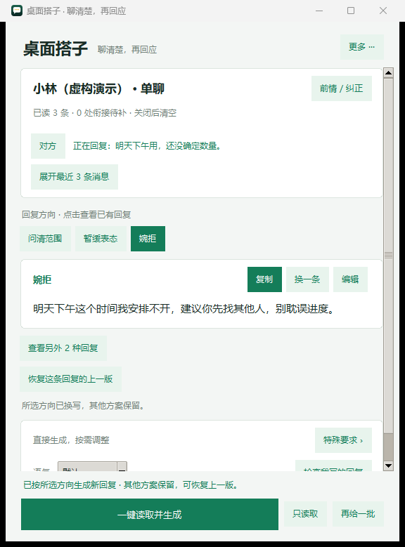

<p align="center"></p>

# 桌面搭子 · WeChat Wingman

按需读取微信窗口，结合双方消息和前情，给出可编辑、可复制的回复建议。使用你自己的模型 API，由你选择并粘贴发送。

[English](README.md) · [Windows 便携版](https://github.com/DuggeeChen/wechat-wingman/releases/latest) · [版本记录](CHANGELOG.md) · [隐私说明](docs/PRIVACY.md)


<p align="center"></p>

## 当前功能

- **一键读取并生成**：先识别截图中的双方消息，再结合本次已读上下文生成回复。也支持只读取和手动导入文字。
- **补齐前因后果**：继续读取、补读更早记录或填写前情。可靠重叠才自动连接片段；缺少衔接或聊天对象变化时由你确认。
- **纠正说话人**：点击消息身份，改为「我 / 对方 / 待确认」；可编辑原文与群聊昵称，撤销最近一次纠正。关键身份不明时暂停生成。
- **回复优先**：点击方向即时查看该方向已有回复，切回来沿用最新文字；卡片上的「换一条」才触发新内容。其他方案保留，失败或取消恢复原建议，可恢复这一条的上一版。「特殊要求」可选，无需先填写目标或底线。
- **表达风格**：默认、商务、亲密、上级、客套分别约束用词、句式与分寸；风格库自定义说明会作为写作要求传给模型。修改当前风格后重新生成生效，见 [语气说明与实测样例](docs/VOICE.md)。
- **完整候选提前可用**：兼容流式接口返回第一条完整回复后即可复制，其余候选与依据在同一次请求中继续补齐。不会把半句话当成完成的回复。
- **界面内更换模型**：「更多 → 模型与 API 设置」修改供应商地址、模型及密钥，获取模型列表、测试连接；凭据按接口隔离保存。
- **按需清理**：「更多 → 清理截图与临时数据」处理遗留调试截图与轮换日志，重置识别缓存，保留聊天和 API 设置。

不自动发送消息，不读微信数据库，不注入或修改客户端，不自动翻页、不持续盯屏。视觉识别仍可能出错，发送前请核对身份和内容。

## 开始使用

### 便携版

1. 从 [Releases](https://github.com/DuggeeChen/wechat-wingman/releases/latest) 下载 Windows ZIP，完整解压。
2. 双击 `WeChatStrategist.exe`，首次向导中填写支持图片输入的 OpenAI 兼容 Chat Completions 接口、模型和 API Key。
3. 打开具体微信聊天，点击「一键读取并生成」，选择、编辑、复制，然后自己粘贴发送。
4. 后续修改连接使用「更多 → 模型与 API 设置」；`重新配置.bat` 可重开首次向导。

无需安装 Python。便携版个人数据保存在 `%LOCALAPPDATA%\微信军师`；目录名保留以兼容旧版。

### 从源码运行

需要 Windows、Python 3.9+；CI 使用 Python 3.13。

```powershell
git clone https://github.com/DuggeeChen/wechat-wingman.git
cd wechat-wingman
python -m pip install -r requirements.txt
python wx_helper.py
```

也可双击 `launch.bat` / `launch.vbs`。首次运行会生成私有 `config.json` 并打开向导。源码版个人数据在程序目录；升级时保留自己的配置和凭据，不用示例配置覆盖它们。

## 模型与速度

支持 OpenAI 兼容 `/chat/completions`；截图识别模型须支持图片。原生 Messages 或 Responses 接口不能直接替换此地址，兼容性以连接测试为准。

新截图的一键流程通常有两次串行请求：**识别图片 → 生成文字回复**。完全未变化的画面可复用已接受的识别结果；纯文字重试无需重新截图。连接复用和提前显示完整候选改善等待体验，但不能消除供应商排队、处理和网络延迟。

方向切换和展开其他方案不请求模型；「换一条」使用已读上下文生成所选方向的新回复，无需重新识别截图。切回该方向会复用换写或手动编辑后的最新版本。

日志分别记录识别、生成及首条可用回复的耗时，不记录聊天正文或密钥。非流式 JSON 或字段顺序不同的接口仍可显示最终结果，但可能无法提前显示。

v2.6.1 为 DeepSeek 官方 `deepseek-flash` / `deepseek-v4-pro` 启用 JSON 输出，截图识别明确关闭思考。空正文、截断或无效 JSON 最多自动恢复一次，仍共用识别阶段的 60 秒上限；正常成功不增加请求。自定义接口不附加这些供应商专用参数，回复生成的思考设置保持原样。

## 数据与兼容性

当前聊天和前情只保留在本次运行内存中，关闭后清空。主流程不保存截图，识别缓存只有上一张画面的指纹；日志约 1 MB 轮换。清理缓存后，下次读取会重新识别。

识别、生成和草稿检查会把相关内容发给你配置的模型，不是完全离线工具。详见 [隐私说明](docs/PRIVACY.md)。

旧版人物画像保留为手动管理入口，数据在本地 `profiles/`。当前主流程不自动建立画像、不注入旧画像、不调用 Jev；主动导入画像仍会调用模型，旧模块仅作兼容保留。

## 开发与打包

```powershell
python -m unittest discover -s scripts -p "test_*.py" -v
python scripts/check_no_secrets.py
python wx_helper.py --selftest
python -m pip install pyinstaller
.\build_portable.ps1
```

测试使用虚构对话、隔离目录、模拟凭据和本机 HTTP 服务，无真实聊天或远程模型请求。Windows CI 检查回归、首次配置、模型设置、打包和私有文件隔离。

[架构](docs/ARCHITECTURE.md) · [常见问题](docs/FAQ.md) · [安全政策](SECURITY.md) · [MIT 许可](LICENSE)
