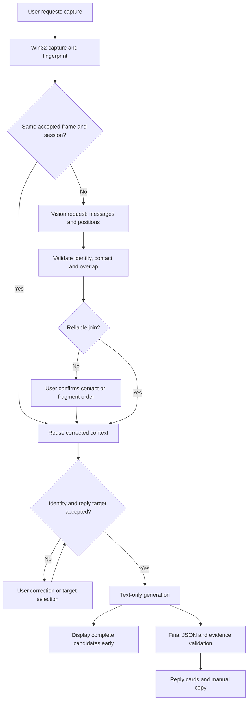

# Architecture — v2.6.5

`BuddyApp` is the default Tk entry. It uses `wx_helper` for Win32 capture and bounded HTTP, and inherits shared window infrastructure from `wx_ui.ReplyApp`, overriding its legacy reply pipeline.

| Module | Responsibility |
|---|---|
| `buddy_ui.py` | Sessions, workflow guards, corrections, cards, event epochs and manual copy. |
| `buddy_context.py` | Position/role checks, conservative overlap joins, bounded context and incremental candidate JSON. |
| `wx_helper.py` | Capture, encoding, credentials, bounded worker requests, SSE, fallbacks and HTTP leases. |
| `model_settings.py`, `setup_wizard.py` | Provider setup, transactional changes, endpoint-isolated credentials and synthetic tests. |
| `runtime_cleanup.py` | Three allowlisted disposable filenames; no recursive cleanup. |
| `app_paths.py`, `credential_store.py` | Source/frozen data locations and Windows Credential Manager. |
| `wx_ui.py`, `ui_theme.py` | Shared UI infrastructure and retained legacy UI. |
| `profile.py`, `profile_ui.py`, `jev_advisor.py` | Compatibility modules, outside the default reply pipeline. |

Messages have local IDs, roles and sources; user background is separate from quotes. Reliable suffix/prefix overlap is required for automatic joining. A new contact never silently joins the active conversation. Pending fragments, unknown recent identity or missing targets block generation; a last self-message needs an explicitly selected target for a follow-up.

Prompt context is bounded to 100 messages and approximately 24,000 text characters, with omission disclosure and explicit-target retention. Session storage itself is not automatically trimmed.

New captures normally require two sequential requests with separate 60-second stage budgets. Concurrency is limited to two workers; leased HTTP sessions are not shared concurrently. Fallbacks use the same endpoint and remaining stage budget. Cancellation suppresses stale UI events rather than claiming to stop remote computation.

For exact official DeepSeek endpoints (root or `/v1`) and the supported Flash/Pro model IDs, main-workflow requests enable JSON output. Recognition explicitly disables thinking; generation keeps its configured preference. Empty final content, `length` finishes and malformed capture JSON can recover once with the same image/prompt and original deadline. Authentication, filtering, cancellation and ordinary provider errors do not trigger this recovery. Other endpoints and legacy requests receive no new provider-specific parameters.

SSE content deltas, not reasoning, enter the collector. Complete candidate objects are published after the question field arrives. Copy is enabled; editing waits for completion. Fallback resets previews. Malformed, interrupted or inconsistent final results remove previews and prompt review of already copied text. JSON-only responses retain the full-result path.

Direction selection only changes the displayed card index. Current cards are the in-memory cache for each direction, including generated and manual edits. Explicit rewrites use a separate `direction` mode with the same guarded text transport. The selected label, optional intent, original card and previous text enter the prompt; it requests exactly one fresh candidate. Normalization and high text-similarity checks reject old or nearly unchanged wording before preview/final acceptance; these are not semantic classifiers. UI events replace only the selected card. Busy clicks cannot create concurrent rewrites. Cancellation/failure restores the snapshot only when its conversation basis is current; late events cannot overwrite newer state. Restoring the latest previous version replaces just that card. Context, voice name and definition are part of the basis; snapshots stay in session memory.

Voice name and definition enter system writing instructions, separate from quoted conversation data. `tone_styles.py` supplies concrete built-ins and upgrades only exact original definitions during config loading in memory; it does not write config or overwrite custom definitions. Closing the style editor invalidates cards if their selected voice changed. Candidate intents preserve strategy during rewrites; duplicate initial cards are collapsed consistently in full and streamed parsing.

Logs distinguish local preparation, API completion, parsing and first usable reply. Header time includes both network and server wait, not just connection time. The image cache holds one fingerprint/session ID, not image pixels. Capture and HTTP image data exist only as temporary worker memory.

Transport preserves SSE finish reasons. Diagnostics record safe finish categories, content lengths and error categories, never response text or reasoning. Complete capture/check objects may have harmless wrappers; the parser never selects a nested object from a broken outer object, repairs truncation or accepts duplicate fields.

Tests cover identities, contact isolation, gaps, stale/cancelled events, connection reuse, synthetic SSE, settings, inline edits and cleanup boundaries without real model calls.

Capture selection filters visibility and DWM cloaking before size checks. Invalid raw render surfaces cannot enter cropping, cache acceptance or vision requests. Only failed background captures use a guarded foreground screen capture, with checks before and after it; normal success adds no foreground switch or model request.

The accepted-frame cache includes message IDs. On an explicit reread, unresolved uncorrected screenshot identities bypass the reuse branch. The result updates only unknown identities after exact contact/frame and ordered text/ID validation; it never appends a second copy of the same frame or replaces manual corrections. Identity reasons are bounded categories retained locally and logged only as counts.
